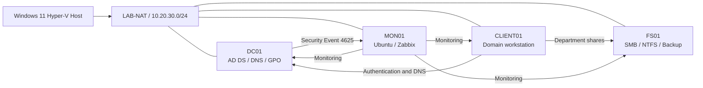

# Hybrid Windows/Linux System Administration Lab

Designed and validated a four-VM Hyper-V lab that simulates a small-business IT environment. The project implements Active Directory, DNS, Group Policy, AGDLP file access, backup and recovery, hardened Linux administration, Zabbix monitoring, selected Windows Security event collection, and scheduled PowerShell health reporting.

## Architecture



| System | Address | Role |
|---|---:|---|
| `DC01` | `10.20.30.10` | Windows Server 2025 domain controller, DNS, Active Directory, and Group Policy |
| `CLIENT01` | `10.20.30.20` | Windows 11 domain workstation used for policy, access, and automation tests |
| `MON01` | `10.20.30.30` | Ubuntu Server 24.04 LTS with hardened SSH, UFW, MySQL, Nginx, and Zabbix 7.4 |
| `FS01` | `10.20.30.40` | Windows Server Core file server with AGDLP permissions, SMB shares, backup, and restore |

Domain: `corp.example.test`

## What I implemented

- Isolated Hyper-V networking with NAT internet access and no direct bridge to the physical LAN.
- Active Directory OUs, users, global and domain-local groups, DNS, domain join, and scoped Group Policy.
- Five departmental SMB shares with AGDLP, explicit NTFS/share permissions, and least-privilege access tests.
- A backup/delete/restore test with matching SHA-256 content hash and ACL verification.
- Ubuntu administration with static networking, AD DNS integration, key-only SSH, disabled root/password SSH, and UFW restrictions.
- Zabbix monitoring for all four systems, including a controlled agent outage and recorded recovery.
- Selected Event ID `4625` collection from `DC01`; three failures within five minutes raise a Warning that automatically recovers.
- A daily PowerShell health report that checks DNS, reachability, and role-specific ports and writes CSV/HTML output.

## Technologies

Hyper-V · Windows Server 2025 · Windows 11 · Active Directory Domain Services · DNS · Group Policy · SMB/NTFS · PowerShell · Ubuntu Server · OpenSSH · UFW · Zabbix 7.4 · MySQL · Nginx

## Automation

| Script | Purpose | Run from |
|---|---|---|
| [`New-FileServerGroups.ps1`](scripts/New-FileServerGroups.ps1) | Creates AGDLP domain-local groups and nesting | `DC01` |
| [`Configure-FS01Shares.ps1`](scripts/Configure-FS01Shares.ps1) | Creates folders, explicit NTFS ACLs, and SMB shares | `FS01` |
| [`Test-FS01Access.ps1`](scripts/Test-FS01Access.ps1) | Validates allowed and denied file access | `CLIENT01` as a test user |
| [`Install-ZabbixAgent2.ps1`](scripts/Install-ZabbixAgent2.ps1) | Installs Agent 2 and restricts TCP 10050 to `MON01` | Windows hosts |
| [`Test-LabHealth.ps1`](scripts/Test-LabHealth.ps1) | Produces DNS, ICMP, and service-port CSV/HTML reports | `CLIENT01` |
| [`Register-LabHealthTask.ps1`](scripts/Register-LabHealthTask.ps1) | Schedules daily unattended health checks | `CLIENT01` |

Review parameter defaults before running a script. Use an elevated PowerShell session and the system named in the table.

## Validation and evidence

| Capability | Controlled test | Evidence |
|---|---|---|
| Domain and policy | Client domain join and scoped GPO application confirmed | [`03-client-domain-join`](screenshots/03-client-domain-join), [`04-group-policy`](screenshots/04-group-policy) |
| Least privilege | IT user wrote to `IT$` and `Public` but was denied access to `Finance$` | [`05-file-server`](screenshots/05-file-server) |
| Recovery | Deleted file restored with matching content hash and ACL | [`06-backup-restore`](screenshots/06-backup-restore) |
| Monitoring incident | Stopped Agent 2 on `FS01` produced an alert and recovery | [`07-monitoring`](screenshots/07-monitoring) |
| Security event | Failed logons reached Zabbix, crossed a threshold, and recovered | [`08-centralized-logging`](screenshots/08-centralized-logging) |
| Unattended automation | Daily task ran as `SYSTEM`, generated two reports, and returned code `0` | [`09-automation`](screenshots/09-automation) |

## Repository structure

```text
docs/         Architecture decisions, implementation records, and guides
scripts/      Reusable PowerShell configuration and verification scripts
screenshots/  Sanitized evidence grouped by project phase
```

Start with the [verified build record](docs/02-build-record.md). For a complete explanation of every component, workflow, and test, see the [Bulgarian project guide](docs/06-project-guide-bg.md).

## Documentation

- [Planning and addressing](docs/01-planning.md)
- [Verified build record](docs/02-build-record.md)
- [Linux and Zabbix implementation](docs/03-mon01-monitoring.md)
- [Windows security-event monitoring](docs/04-centralized-logging.md)
- [Administration automation](docs/05-automation.md)
- [Complete project guide in Bulgarian](docs/06-project-guide-bg.md)

## Security and limitations

- Passwords, private keys, product keys, VM disks, ISO images, and backup media are excluded from Git.
- `MON01` is intentionally not domain joined; it uses AD DNS but remains independently administered.
- The backup workflow is proven, but VM and backup virtual disks reside on the same physical drive. Production should use the 3-2-1 rule.
- Zabbix stores selected security events for operational monitoring; this is not presented as a full SIEM implementation.
- The lab uses evaluation operating systems and environment-specific names, addresses, paths, and script defaults.
